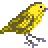

 Canary3DS
==

A 3DS music player with modern features.

## Features
- Supports many audio file formats: `mp3`, `flac`, `m4a`, `aac`, `wav`, `opus`, `vorbis`
- Allows enqueuing audio files, has a queue which songs can be added to and played from
- Creating playlists, which are stored in the standard `m3u` file format
- Powerful filebrowser with context menus that allows bulk operations to add to queue/playlist
- Supports displaying embedded cover art. Can set custom cover art for playlists
- Automatically plays next file
- Settings menu to customize configuration
- Seeking with a touch seek bar on the bottom touch screen, or using the left/right dpad to seek in steps

#### Planned
- Indexing system to allow viewing songs in groups of albums or artist

## Controls
- double tap `R`: toggle play/pause
- triple tap `L`: go to previous song
- triple tap `R`: go to next song

###### Filebrowser Screen
- `A`: Song selected: Play selected song and switch to Player Screen. Folder selected: Open selected folder
- `B`: Go to parent folder
- `X`: Open context menu
- `Y`: Switch to Player Screen

###### Player Screen
- `A`: Play selected song in sidebar
- `B`: Go back to file
- `X`: Open context menu
- `Y`: Switch to Filebrowser Screen

###### Playlist Screen
- `A`: Open playlist/play song in playlist
- `B`: Exit playlist
- `X`: Open context menu

###### Settings Screen
- `A`: Modify setting
- `B`: Go to Filebrowser Screen
- `X`: Open context menu

## Assets
- [Unbreakable Resolve](https://www.bensound.com/royalty-free-music/track/unbreakable-resolve-hopeful-epic) by Lunar Years on Bensound for home menu banner music
- [Iconoir](https://iconoir.com/) for user interface icons
- [@narayanx](https://github.com/narayanx) for home menu icon and banner pixel art images

## Credits
- [ctrmus](https://github.com/deltabeard/ctrmus) by [@deltabeard](https://github.com/deltabeard) for initially inspiring this project
- [3DShell](https://github.com/joel16/3DShell) by [@joel16](https://github.com/joel16) for inspiring the appearance of the player screen and inspiring this project
- [pomegranate](https://github.com/sheepy0125/pomegranate) by [@sheepy0125](https://github.com/sheepy0125) for the idea for shoulder button controls and music library indexing
- [Video_player_for_3DS](https://github.com/Core-2-Extreme/Video_player_for_3DS)/[FFmpeg for 3DS](https://github.com/Core-2-Extreme/FFmpeg_for_3DS) by [@Core-2-Extreme](https://github.com/Core-2-Extreme) for the instructions for building FFmpeg which allows aac/m4a support
- [RIP](https://github.com/kynex7510/RIP) by [@kynex7510](https://github.com/kynex7510) for the library to convert decoded images into the 3DS internal image format
- [stb_image](https://github.com/nothings/stb) by [@nothings](https://github.com/nothings) for the image decoding library
